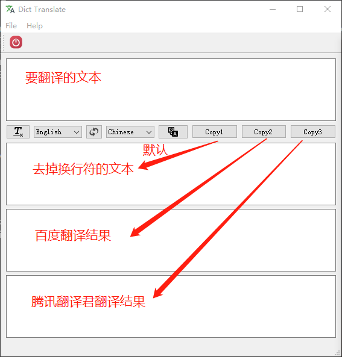

# zdict
这个字典源码来自[这里](https://github.com/ouening/python-code)，之所以有这个翻译软件是因为本人翻译pdf文献时，复制到一般翻译软件时会有换行符导致翻译不准确，因此我改了上述地址的代码。主要改动如下：
- 添加了腾讯翻译君的API
- 更改界面，使下面有是哪个框，可以同时显示去掉换行符文本、百度翻译结果、腾讯翻译君翻译结果。
- 实现了原作者没有实现的交换源语言和目标语言功能
- 复制翻译的结果

界面效果图：

## 依赖环境
- Python 3.6
- Pyqt
- tencentcloud-sdk-python(pip install tencentcloud-sdk-python)

## 运行
安装上述依赖后，执行`python zdict.py`即可

## 亮点：
- 从pdf中复制出来一串文字时自动去掉换行符
- 有腾讯翻译君和百度翻译两个API

## TODO
- [ ] 改进删除换行符的算法
- [ ] 鲁棒性增强，现在程序有的时候会崩溃
- [ ] 增加更多翻译API
- [ ] 增加填写appKey和secretKey
- [ ] 改进皮肤